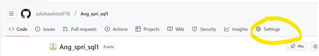

## **Para que el participante pueda acceder al ejercicio es necesario invitarlo a este repositorio**

### Indicaciones para invitar a un participante

Seleccionar settings

 

Invitar a un colaborador

Agregar 

Mostrará este mensaje de invitación, quedará como pendiente y se quitará cuando el invitado la acepte.

### Evaluar a un participante

Para evaluar a un participante, selecciona Pull request, el número que veas a un lado es el número de participatnes que han enviado su solución.

Podrás identificar la entrega y el participante con los datos que aparecen con en la siguiente pantalla:

Selecciona al repositorio del participante como en la pantalla siguiente.

Esta acción te llevará al repositorio del participante y selecciona Actions.

Ahi podrás observar si el action esta en verde que significa que todo se ejecutó correctamente.

En caso de que el action marque fallido, podrás consultar la falla dando click sobre el action.

Selecciona el action fallido para ver el detalle del log.

Podrás evaluar conforme al criterio definido para este ejercicio y notificarás al participante.

Si requieres ver la solución funcionando, deberás utilizar un Codespace.

Asegurate de estar en tu repositorio, ya que el repositorio del participante es muy parecido en cuanto a la estructura y rama.

Una vez que estés en tu repositorio como instructor, selecciona Pull request.

Selecciona el request del ejercicio y participante a evaluar.

Selecciona Code, luego la pestaña Codespaces y selecciona Create Codespace on ...

Tendrán una pantalla como esta en el browser.

Si requieres utilizar Visual Studio Code, regresa a la pantalla, refresca y selecciona Code, selecciona Codespaces, selecciona los 3 puntos y selecciona Open in Vicual Studio Code.

