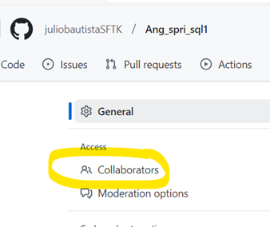

## **Para que el participante pueda acceder al ejercicio es necesario crear un fork desde este repositorio**

### Indicaciones para invitar a un participante a un ejercicio por medio de un fork

Seleccionar settings

 

Invitar a un colaborador

Agregar 

Mostrará este mensaje de invitación, quedará como pendiente y se quitará cuando el invitado la acepte.

### Evaluar a un participante
