### Indicaciones para el Participante
Notificación al invitado, se verá en tu github una notificación como la siguiente pantalla.

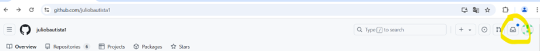

La notificación es similar a un correo 

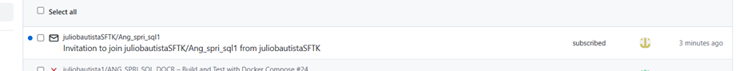

Selecciona aceptar invitación.

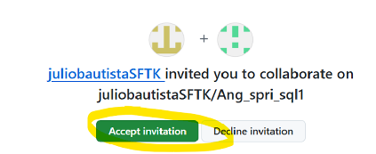

Selecciona fork

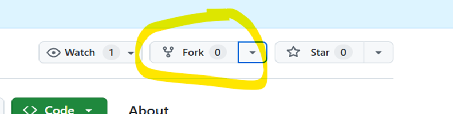

Selecciona crea un nuevo fork

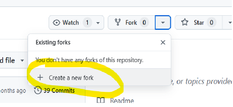

Es recomendable dejar el nombre que se presenta default y selecciona el botón create fork

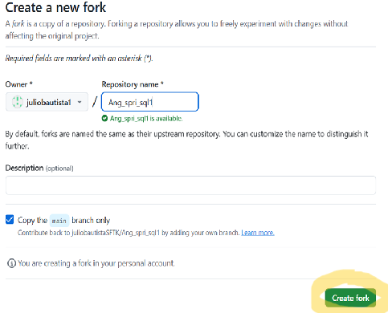

Aparecerá este mensaje “forked from” 

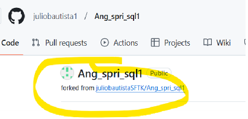

Se verá así.

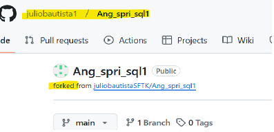

Para acceder a un Codespace selecciona Code una vez dentro de tu repositorio.

Tendremos esta ventana con 2 pestañas

Selecciona Codespaces

Tendrás esta pantalla, en este ejemplo el Codespace se generará con las instrucciones en la rama main. 
Espera hasta que presente una pantalla similar a esta:

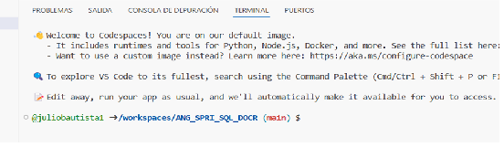

Ya puedes utilizar este Codespace
Si quieres utilizar el Codespace con Visual Studio Code, necesitas tener instalado previamente Visual Studio Code en tu computadora.
Tendrás una pantalla como la siguiente:

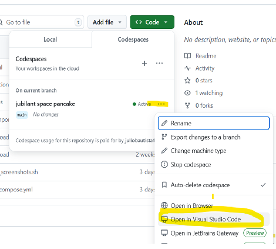

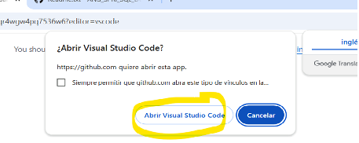

Espera unos minutos en lo que levanta el CodeSpace y tendrás una pantalla como esta:

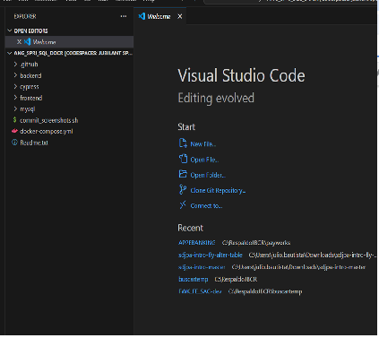

Si no aparece la sección de la terminal presiona control-ñ

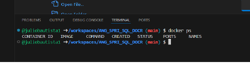

Una vez que hayas terminado de resolver el ejercicio, deberás hacer push a la rama, esto disparará un action
El action está diseñado para validar el cumplimento de ciertos pasos, para ver el resultado en tu repositorio selecciona Actions

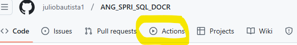

Para ver el resultado del action seleccionalo

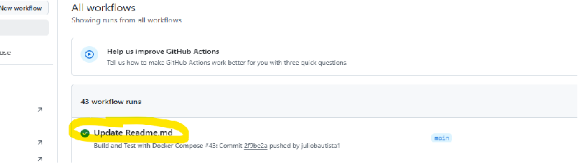

Si falló el action podrás consultar el log dando click sobre el action
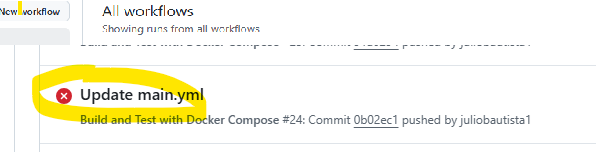
Selecciona el action fallido para ver el detalle del log
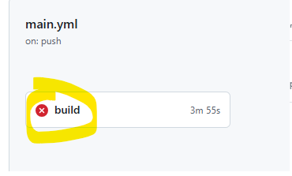
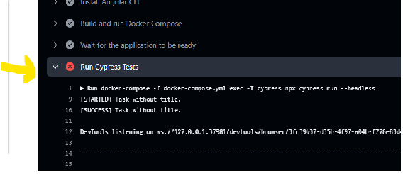

Para entregar tu ejercicio, debes previamente hacer el push a tu rama en tu repositorio.

Una vez que tu solución esté en la rama, deberás 
