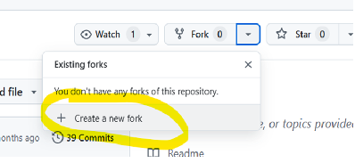

# **Crear un Fork desde un repositorio externo**

## Indicaciones para el Instructor

Seleccionar settings

Invitar a un colaborador

Agregar 

Mostrará este mensaje de que estará pendiente la invitación y se quitará cuando el invitado la acepte.

## Indicaciones para el Participante
Notificación al invitado

Llega un correo 

Selecciona aceptar invitación.

Selecciona fork

Selecciona crea un nuevo fork

Es recomendable dejar el nombre que se presenta default y selecciona el botón créate fork

