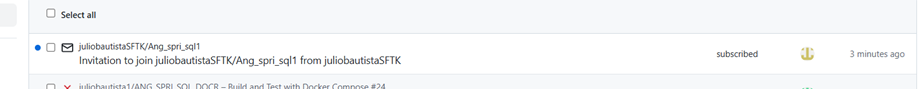
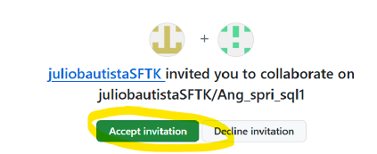
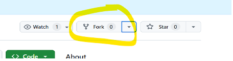
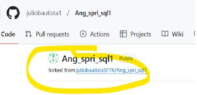
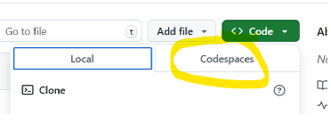
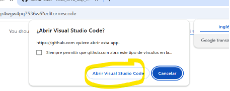
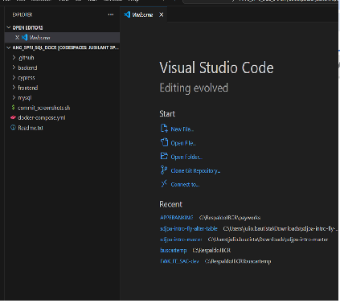

# **Ejercicio TITULO DEL EJERCICIO**

# **Objetivo:**
El objetivo es crear un contenedor de base de datos mysql con la versión 5.6, crear una aplicación de que permita un altas, bajas y cambios.

## **Crear un Fork desde un repositorio externo**

### Indicaciones para el Instructor

Seleccionar settings

Invitar a un colaborador

Agregar 

Mostrará este mensaje de que estará pendiente la invitación y se quitará cuando el invitado la acepte.

### Indicaciones para el Participante
Notificación al invitado

Llega un correo 

Selecciona aceptar invitación.

Selecciona fork

Selecciona crea un nuevo fork

Es recomendable dejar el nombre que se presenta default y selecciona el botón create fork

Aparecerá este mensaje “forked from” 

Se verá así.

#### Ambientación del ejercicio 
Este ejercicio contiene instrucciones que ambientan e instalan lo necesario para el ejercicio, a excepción que el ejercicio incluya ambientar o instalar.

#### Actions
En GitHub, los Actions son una herramienta que permite automatizar flujos de trabajo dentro de un repositorio, como compilar código, ejecutar pruebas, desplegar aplicaciones, crear contenedores Docker, entre otros. Se basan en el concepto de CI/CD (Integración continua / Despliegue continuo) y te permiten definir acciones automáticas que se ejecutan en función de eventos que suceden en tu repositorio (por ejemplo, un "push" de código, la creación de un "pull request", etc.).
Los GitHub Actions permiten definir workflows (flujos de trabajo) que se pueden configurar con archivos de definición en formato YAML dentro del directorio .github/workflows de tu repositorio. Estos workflows pueden contener varias acciones (tasks o steps), y GitHub ejecutará esas acciones en los eventos que especifiques.

Este ejercicio contiene un Action, que no debe ser modificado, este action se ejecuta en cada push a la rama relacionada, en la mayoría de los ejercicios, este action compila, ejecuta pruebas unitarias y otras que permiten validar el resultado del ejercicio, este resultado se toma de base para la calificación.

#### Codespaces

GitHub Codespaces es un entorno de desarrollo integrado (IDE) basado en la web, completamente configurado y alojado en la nube, que permite a los desarrolladores escribir, compilar, probar y depurar código directamente desde GitHub. Codespaces proporciona una máquina virtual (VM) con todas las herramientas necesarias para trabajar en un proyecto, de modo que puedes desarrollar sin necesidad de configurar manualmente un entorno local.
Este ejercicio está configurado para crear un Codespace y se ejecuten las instrucciones necesarias para ambientar una maquina virtual y puedas hacer el ejercicio, es importante no alterar el codespace a menos que el modificarlo sea parte del ejercicio.
Para acceder a un Codespace selecciona Code una vez dentro de tu repositorio.

Tendremos esta ventana con 2 pestañas

Selecciona Codespaces

Tendrás esta pantalla, en este ejemplo el Codespace se generará con las instrucciones en la rama main. 
Espera hasta que presente una pantalla similar a esta:

Ya puedes utilizar este Codespace
Si quieres utilizar el Codespace con Visual Studio Code, necesitas tener instalado previamente Visual Studio Code en tu computadora.
Tendrás una pantalla como la siguiente:

Espera unos minutos en lo que levanta el CodeSpace y tendrás una pantalla como esta:

Si no aparece la sección de la terminal presiona control-ñ

